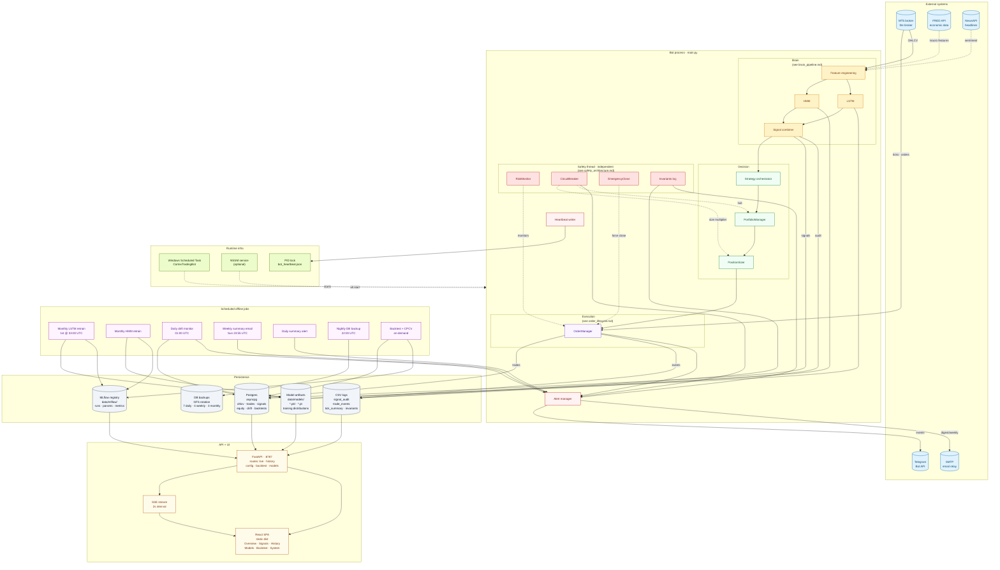

# High-Level Architecture

Every component of the Cortex system in one view. This is the C4-style
container diagram — shows what runs where, what talks to what, and which
piece stores which data.

For **what flows through** these components, see
[data_flow.md](data_flow.md). For **internals** of any single component,
see the specialized diagram in its subgraph label.

## Diagram

## Containers, grouped

### External systems (5)

| Container        | Role                                  | Criticality    |
|------------------|---------------------------------------|----------------|
| **MT5 broker**   | Market data + order routing           | Hard dependency |
| **FRED API**     | Economic/macro features               | Soft (cached, bot runs without it) |
| **NewsAPI**      | News sentiment per-symbol             | Soft (empty → sentiment=0.0) |
| **Telegram**     | Real-time operator alerts             | Soft (logs stay) |
| **Email (SMTP)** | Daily/weekly digests                  | Soft            |

### Bot process · `main.py` (4 logical modules + helpers)

Runs as a **single Python process** but with two threads: main (brain work)
and safety (watchdog). The PID is captured to
`data/logs/bot_heartbeat.json` so the launcher can detect duplicates.

| Module            | Key files                                  | Drill-down |
|-------------------|--------------------------------------------|------------|
| **Brain**         | `src/brain/`, `src/data_pipeline/`         | [brain_pipeline.md](brain_pipeline.md) |
| **Decision**      | `src/strategy/`, `src/allocation/`         | [order_lifecycle.md](order_lifecycle.md) |
| **Safety**        | `src/safety/`                              | [safety_architecture.md](safety_architecture.md) |
| **Execution**     | `src/broker/`                              | [gating_sequence.md](gating_sequence.md) |
| Alert manager     | `src/alerts/manager.py`                    | Telegram + email routing |
| Heartbeat writer  | in-process                                 | PID lock + equity snapshot |

### Persistence (5 stores, different jobs)

| Store                 | What lives there                                              | Why separate |
|-----------------------|---------------------------------------------------------------|--------------|
| **Postgres**          | OHLCV · trades · signals · equity · drift · backtests         | Structured, queryable, account-segmented |
| **CSV logs**          | signal_audit · trade_events · tick_summary · invariants       | Forensic detail Postgres doesn't carry; survives DB wipe |
| **Model artifacts**   | `data/models/{lstm,hmm}_SYMBOL.{pt,pkl}` + training distributions | Binary, regenerated monthly |
| **MLflow registry**   | Runs, params, metrics, dataset fingerprints                   | Training provenance + `model_bench.py` comparisons |
| **DB backups**        | Nightly `pg_dump -Fc` with GFS rotation                       | Disaster recovery (see `docs/operations/postgres_dr.md`) |

### API + UI

- **FastAPI** on port 8787. Single source of truth for the dashboard.
  Route modules: `live`, `history`, `config`, `backtest`, `models`,
  `accounts`, `system`, `auth`, `invariants`, `news`.
- **SSE stream** broadcasts live state (regime, positions, equity) every
  2 seconds.
- **React SPA** is statically built to `src/api/static/dist/` and served by
  FastAPI. Screens: Overview, Signals, History, Models, Backtest, System.
  Bot runs even if the frontend is broken — they're fully decoupled.

### Scheduled offline jobs (7)

Independent processes kicked off by Windows Task Scheduler or cron
(depending on deployment). Never run in-process — the bot can't accidentally
block training, and training can't accidentally touch the running bot.

| Job                   | Schedule                      | Writes to           |
|-----------------------|-------------------------------|---------------------|
| LSTM retrain          | 1st of month · 03:00 UTC      | Models + MLflow     |
| HMM retrain           | 1st of month                  | Models + MLflow     |
| Drift monitor         | Daily · 01:00 UTC             | `drift_scores` (PG) |
| DB backup             | Daily · 22:00 UTC             | Backups directory   |
| Daily summary alert   | End-of-day                    | Telegram + email    |
| Weekly summary email  | Sunday · 23:55 UTC            | Email only          |
| Backtest + CPCV       | On-demand                     | PG + MLflow         |

### Runtime infrastructure

- **Windows Scheduled Task** `CortexTradingBot` is the primary launcher.
- **NSSM service** is the alternate — wraps the bot as a Windows service
  (optional, not always enabled).
- **PID lock** via `bot_heartbeat.json` prevents double-start (learned from
  the April-13 "duplicate bot process" incident).

## Key invariants the architecture enforces

1. **Brain never calls MT5 directly** — only OrderManager talks to the
   broker. Every other module has to go through it.
2. **Safety thread is a separate thread, not a separate process** — but it
   doesn't share state with brain beyond the atomic `positions_lock`.
3. **Training is offline** — the running bot never retrains a model.
   Monthly subprocess is the only path.
4. **Dashboard is read-only from the bot's perspective** — operator actions
   (account switch, pause) go through FastAPI endpoints that write to
   `LiveState`, which the bot polls.
5. **Account segmentation** everywhere — trades, signals, equity all tagged
   with `mt5_account`. Switching accounts gives you a clean view.

## Trust boundaries

- **Outside the bot process** (external systems, operator UI) → never
  trusted. All input validated at the boundary.
- **Inside the bot process** → trusted (dataclasses over Pydantic for
  internal types).
- **Offline jobs** are separate trust zones — they write to persistent
  stores the bot will consume, so their output is effectively an external
  input after the fact. Hence MLflow fingerprinting, dataset hashes, and
  head-shape checks on model load.

## What this diagram intentionally hides

- Request/response details inside FastAPI routes (see `src/api/routes/`)
- Exact retry semantics inside `OrderManager` (3× 20s on transient only)
- The five specific strategies inside the orchestrator (high_vol,
  mid_vol, low_vol) — strategy selection is a runtime policy, not a
  container.
- Individual dashboard screens — the React app is one "container" here
  but is actually 6+ lazy-loaded screens.

Drill into the per-subsystem diagrams for any of these.
