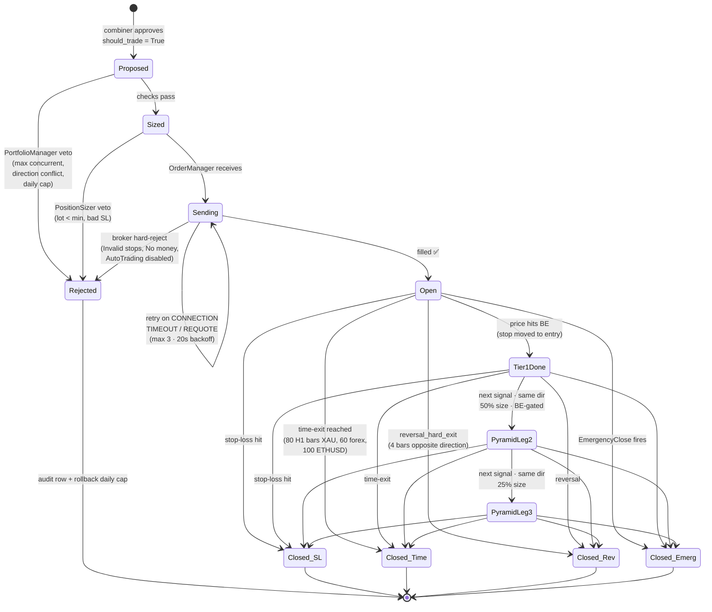

# Order Lifecycle — from signal to close

A position's full life, as a state machine. Starts the moment the combiner
says `should_trade=True` and ends when the position closes (via stop, target,
reversal, time-exit, or emergency).

## State diagram

## State explanations

### Pre-send

- **Proposed** — brain said yes, nothing else has looked at it. This is the
  moment a signal becomes a candidate trade. Writes to `signal_audit.csv` with
  `should_trade=True`.
- **Rejected** — one of the non-brain layers vetoed. Writes audit row with
  `block_reason`, rolls back the daily-cap counter (so a broker reject doesn't
  burn a trade slot from the 12/day limit), and ends.
- **Sized** — PositionSizer translated risk % + SL distance into lot size.
  Uses the symbol's tick value and quote currency so risk is leverage-neutral
  across all 5 symbols.
- **Sending** — OrderManager has the payload and is talking to MT5. Retries
  only on transient errors. Real broker rejects fail fast.

### Post-fill

- **Open** — position is live on the broker. Stop-loss is guaranteed to exist
  (OrderManager rejects any payload without one).
- **Tier1Done** — price moved to break-even. Stop-loss is pulled up to the
  entry price (or entry ± small buffer). **This is what unlocks pyramiding**
  — no leg 2 without tier_1_done on leg 1.
- **PyramidLeg2 / PyramidLeg3** — additional positions in the same direction.
  Fractional sizing: 100% → 50% → 25%. Max 3 legs. Each new leg requires the
  **previous** leg's tier_1_done to be true.

### Exit paths

Four independent exit conditions, all always running once Open:

1. **Closed_SL** — stop-loss hit. The primary risk control.
2. **Closed_Time** — held longer than the per-symbol time budget. Prevents
   stale positions from drifting through regime changes.
3. **Closed_Rev** — direction has flipped on the latest H4 bar for 4
   consecutive bars (`reversal_hard_exit`). Catches trend breaks that don't
   trigger the stop-loss.
4. **Closed_Emerg** — safety layer force-closed. See
   [safety_architecture.md](safety_architecture.md).

## Key invariants

Several rules this state machine enforces that the code treats as absolute:

| Rule                                             | Where enforced                    |
|--------------------------------------------------|-----------------------------------|
| Every order has a stop-loss                      | `OrderManager._validate_order`    |
| No pyramiding without prior leg's BE             | `PortfolioManager._check_pyramid` |
| No simultaneous buy + sell on same symbol        | Direction-conflict guard          |
| Daily cap rollback on broker reject              | [main.py:842](../../main.py#L842) |
| Position sizing is leverage-neutral              | `PositionSizer._resolve_symbol_spec` |

## Time exits per symbol

| Symbol  | H1 bars | ≈ real time |
|---------|--------:|------------:|
| XAUUSD  | 80      | ~3.3 days   |
| EURUSD  | 60      | ~2.5 days   |
| USDJPY  | 60      | ~2.5 days   |
| USDCAD  | 60      | ~2.5 days   |
| ETHUSD  | 100     | ~4.2 days   |

ETHUSD's longer budget reflects crypto's 7-day trading week — position has
more chances to work out before time pressure kicks in.

## What this diagram doesn't show

- **Retry timing** inside `Sending` — the state-diagram arrow is recursive,
  but in code it's 3 attempts with 20s backoff (`trading.order_retry_attempts`
  and `trading.order_retry_backoff_sec`).
- **Partial fills** — MT5 treats these as full fills for our purposes
  (requested lot size is what gets recorded), so no separate state.
- **Modification events** — BE stop moves, trailing stops. Those are "patches"
  on an Open position that don't change state, just update the SL level.

## Related source

- `src/allocation/portfolio_manager.py` — concurrency, pyramiding, direction
- `src/allocation/position_sizer.py` — risk → lot translation
- `src/broker/order_manager.py` — MT5 send + retry + validation
- `src/strategy/exit_manager.py` — time-exit + reversal_hard_exit logic
- [main.py](../../main.py) — drives the lifecycle

## Read next

- [gating_sequence.md](gating_sequence.md) — the full gate chain, which is
  this diagram's "Proposed → Open" compressed into every single check
  that runs.
