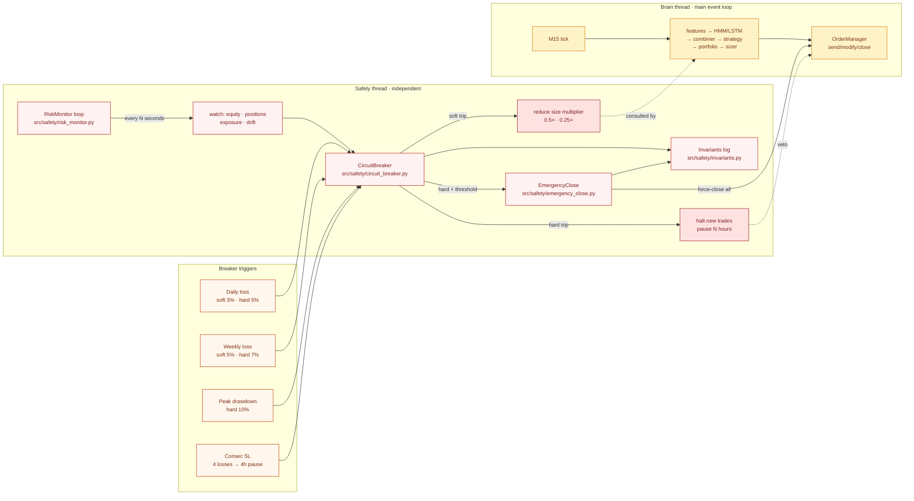

# Safety Architecture — the independent veto

The load-bearing rule from CLAUDE.md:

> **Safety thread is independent of Brain** — absolute veto.

The brain can be confidently bullish and the risk monitor will still slam the
emergency brake if equity crashes. This file shows how that independence is
wired up and what each layer actually watches.

## Diagram

## Three layers, three jobs

### 1. RiskMonitor · continuous watchdog

- Lives in its own thread — started by `main.py` at boot, runs until shutdown.
- Polls equity + open positions + exposure on a short interval (seconds, not
  bars). Never blocked by brain work.
- Holds a reference to `positions_lock` so it can atomically read broker state
  while the brain is mid-evaluation.
- Doesn't make trading decisions — it **feeds** the CircuitBreaker with live
  measurements.

### 2. CircuitBreaker · rule engine

- Stateless *function*: given current equity + recent trade outcomes, it
  returns which breakers are tripped and what size-multiplier should apply.
- **Soft tier** (e.g., 3% daily loss) → position size × 0.5. Brain keeps
  trading but smaller.
- **Hard tier** (e.g., 5% daily loss) → no new trades. Existing positions
  keep running with their own stops.
- **Critical tier** (e.g., 10% peak drawdown) → triggers EmergencyClose.

### 3. EmergencyClose · last resort

- Only fires on catastrophic conditions (peak drawdown, consecutive critical
  breakers).
- Sends market-close orders for every open position.
- Writes a breaker event + invariant violation, alerts operator via Telegram.

## Trigger table

| Trigger              | Soft    | Hard    | Effect                                  |
|----------------------|--------:|--------:|-----------------------------------------|
| Daily loss           | 3%      | 5%      | ×0.5 sizing → no new trades             |
| Weekly loss          | 5%      | 7%      | ×0.5 sizing → no new trades             |
| Peak drawdown        | —       | 10%     | EmergencyClose                          |
| Consecutive stops    | —       | 4 in a row | 4h pause                             |

All numbers sourced from `config/settings.yaml` and validated by the doc-drift
linter.

## Why this separation matters

Three failure modes it prevents:

1. **Brain stuck in a bad loop** — if the combiner starts producing bad
   signals (bug, data corruption, bad retrain), RiskMonitor still sees equity
   bleeding and halts trading.
2. **Single-thread deadlock** — brain work can block (feature engineering on a
   slow day can take seconds). Running safety in the same thread would delay
   breaker checks by that long.
3. **Silent regression** — if a change to brain code accidentally bypasses a
   gate, safety is still watching the *outcome* (equity) and will catch it.

## Related concepts

- **Invariants system** — orthogonal layer that guards runtime truths
  (e.g., "every open position has a stop-loss"). Violations write to
  `data/logs/invariants.jsonl` and surface on the dashboard Health card.
  See `memory/project_invariants_system.md`.
- **Direction-conflict guard** — lives in the brain layer, but enforces a
  similar "don't fire if we're not sure" principle. Lives in
  `src/strategy/orchestrator.py`.

## Read next

- [order_lifecycle.md](order_lifecycle.md) — how the breaker's size
  multiplier actually lands on an order.
- [gating_sequence.md](gating_sequence.md) — all gates from bar close to
  broker fill, including where safety checks slot in.
